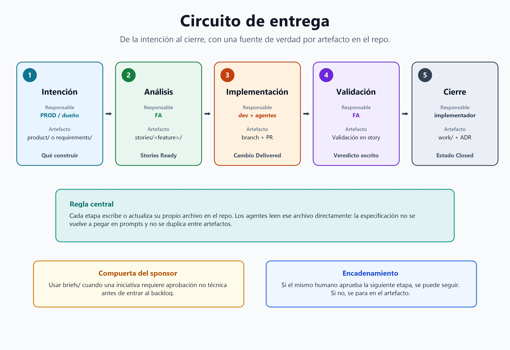

# Circuito de entrega — de la intención al cierre

El estándar de entrega spec-driven (guiado por especificaciones). Define qué artefacto se crea en cada paso, quién lo escribe (humano + rol de agente) y cómo se encadenan. Todo agente que participe en cualquier paso debe conocer este documento.

**Principio rector:** una fuente de verdad por artefacto, siempre en el repo. Los agentes consumen las especificaciones leyendo los archivos directamente — una especificación nunca se re-pega en un prompt. Se escribe una vez y se consume N veces (implementación, QA, validación, auditoría). Un tracker externo, si se usa, guarda solo estado + responsable + un link.

## El circuito

### 0. Compuerta del sponsor (cuando aplica)

Las iniciativas que necesitan la aprobación de un **decisor no técnico** —proyectos nuevos, nuevas ideas de producto, requirements con costo significativo— empiezan como un brief ejecutivo en `briefs/` (escrito por `PROD`, decidido por el sponsor declarado en el mapa de propiedad). No empieza trabajo de backlog mientras el brief no esté aprobado. Las funcionalidades pequeñas dentro de un alcance ya aprobado se saltan esta compuerta. Convenciones: [`../briefs/README.md`](../briefs/README.md).

### 1. Intención

El dueño de producto (rol `PROD`) decide qué se construye. Reglas de negocio estables → `product/` (o el documento de visión del proyecto). Trabajo técnico que no necesita análisis funcional → un requirement en `requirements/<plan>/`, escrito por el rol arquitecto correspondiente. Todo lo demás → abre la carpeta de la funcionalidad en `stories/<feature>/` con un README de contexto de una línea.

### 2. Análisis

El analista funcional (humano, asistido por `FA`) descompone la intención en stories según la plantilla en [`../stories/README.md`](../stories/README.md). Cada story que llega a Ready lleva al menos un **escenario de prueba** — un recorrido concreto y con datos reales (nombre legible, pasos low-level, resultado esperado) que `QA` formaliza después en un caso e2e automatizado; el analista confirma con el autor que los datos que referencia cada escenario ya existen en la base de datos. Las stories entran al repo **vía PR** aprobado por el dueño de producto — esa aprobación las pone Ready (listas). Los analistas no tocan código: su superficie de escritura es solo `docs/stories/`; revisan desde la UI web del host de Git, sin git local.

Si surge una decisión técnica durante el análisis, el analista NO la resuelve: se registra como pregunta abierta y se enruta al rol técnico dueño.

### 3. Implementación

Un dev toma una story o requirement Ready:

- **Branch:** `story/<feature>-NNN-slug` o `req/<plan>-NNN-slug`.
- Anota el branch en el encabezado del work item; estado → In progress (commits en ese mismo branch).
- **Compuerta de estimación:** antes de implementar, el agente evaluador rellena la tabla de estimación (hitos, horas estimadas). Durante la ejecución se registra el inicio/fin real por hito. Ningún work item avanza con una tabla de estimación vacía.
- El agente que implementa lee el work item como su especificación: el prompt de arranque es "implementa `docs/stories/<feature>/NNN-slug.md`" — nada más. Si el agente necesita más contexto, el hueco está en el archivo: arréglalo ahí, no en el chat.
- El PR de implementación enlaza el archivo del work item. Al hacer merge, estado → Delivered.

### 4. Validación

Stories: el analista (asistido por `FA` en modo validación) recorre los criterios de aceptación contra el comportamiento real, registra un veredicto por criterio en la sección Validación de la story. Pasa todo → Validated. Cualquier fallo → de vuelta al dev (esperado vs. observado), el estado vuelve a In progress. La validación es contra los criterios **escritos** — si los criterios pasan pero el resultado se siente mal, eso es una nueva señal de producto para `PROD`, no una validación fallida.

Requirements: verificados contra el Entregable esperado por el rol autor o `SC`.

### 5. Cierre

Estado → Closed (el archivo se congela). Trabajo significativo → entrada en `work/YYYY-MM/`. Horas reales por hito completadas en la tabla de estimación — cerrar con una tabla de estimación incompleta es inválido.

## Matriz rol → artefacto

| Paso | Humano | Rol de agente | Escribe | Lee |
|------|--------|---------------|---------|-----|
| Intención | Dueño de producto | `PROD` | `product/`, `stories/<feature>/README.md`, `requirements/` | todo |
| Análisis | Analistas funcionales | `FA` | `stories/<feature>/*.md` | `product/`, `guides/`, `glossary/` |
| Implementación | Devs | por dominio (`SYS`/`DA`/`FE`/...) | código, `guides/`, `decisions/`, changelog | `stories/`, `requirements/`, `guides/` |
| Validación | Analistas funcionales | `FA` | sección Validación de la story | la story + el producto corriendo |
| Cierre | Implementador | implementador | `work/`, tabla de estimación | — |

## Política de encadenamiento — cuándo correr el siguiente rol, cuándo parar

Tras cerrar su entregable un rol, la siguiente etapa puede encadenarse en la misma sesión o pasarse por el artefacto. La decisión es mecánica, no conversacional:

1. **Busca al dueño** del rol de la siguiente etapa en el `AGENTS.md` del proyecto § Mapa de propiedad de roles.
2. **Mismo humano que el usuario de la sesión** → encadena: corre el siguiente rol ahora, produce su salida como borrador, deja que el usuario apruebe todo junto.
3. **Humano distinto** → para en el artefacto: registra el work item / spec en el repo y termina. El repo es la interfaz asíncrona entre humanos; su compuerta de aprobación (revisión de PR, pase a Ready) no debe ser simulada por un agente.
4. **Encadena solo lo que desbloquea la siguiente decisión del usuario de la sesión** — no toda la cola. Cada rol encadenado suma tokens y volumen de salida; corre la etapa cuyo resultado condiciona todo lo demás (p. ej. modelo de datos, postura de seguridad) y deja el resto para después de la aprobación.

"Dueño" significa quién aprueba la transición de la etapa (el PR, el pase a Ready) — no quién ejecuta el trabajo. Los agentes siempre ejecutan; la propiedad solo decide si el resultado se encadena hacia adelante o espera.

**Fallback:** si falta el mapa de propiedad o el rol no está mapeado, pregunta al usuario una vez y escribe la respuesta en el mapa — la pregunta nunca debe repetirse.

## Economía de tokens — reglas para agentes

1. **Nunca re-expliques una especificación en un prompt.** Apunta al archivo. Si el archivo no alcanza, el archivo está incompleto — arréglalo ahí.
2. **Nunca dupliques contenido entre artefactos.** La story enlaza el ADR; el ADR no repite los criterios; el tracker solo enlaza. Cada duplicación es drift futuro y contexto gastado dos veces.
3. **Lee solo la capa que el paso necesita.** Implementar una story no requiere leer `work/` (es historial) ni cada guía — solo lo que la story lista en Depends on.
4. **Conversación corta, artefacto completo.** Si una sesión de chat produce una definición que habrá que volver a contar mañana, el circuito falló: la definición pertenecía a un archivo.
